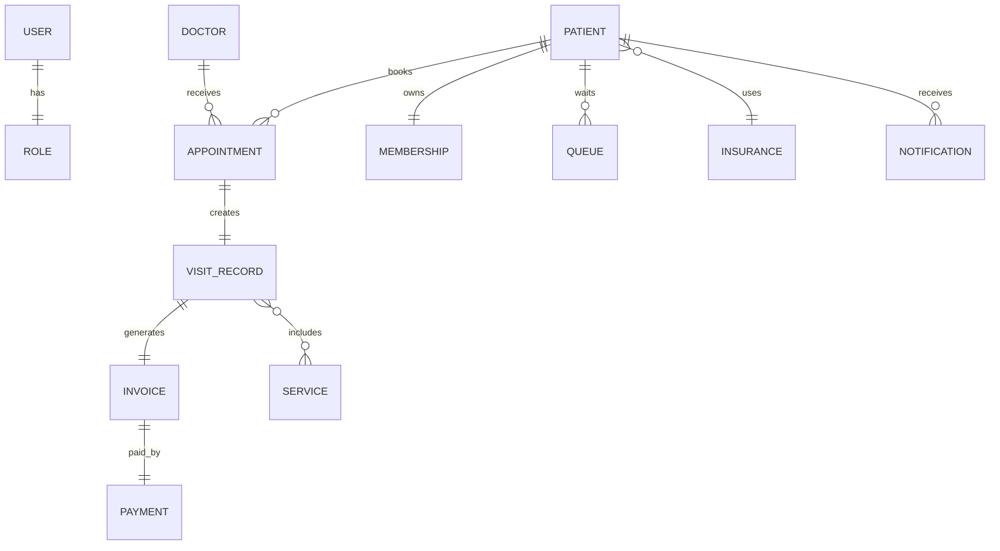

# HACKATHON  - ĐỀ 002

**Sinh viên:** Nguyễn Minh Duy

---

# PHẦN 1: TÁI CẤU TRÚC HỆ THỐNG ĐỂ DỄ MỞ RỘNG

## 1. Mô tả vấn đề

Đoạn mã `ClinicBillingService` ban đầu vi phạm nguyên tắc Open/Closed Principle (OCP) vì:

- Logic tính phí khám, bảo hiểm, thanh toán và gửi thông báo đều nằm trong cùng một phương thức.
- Mỗi lần thêm loại bảo hiểm mới đều phải sửa câu lệnh `if...else`.
- Mỗi lần thêm cổng thanh toán mới cũng phải sửa trực tiếp trong hàm.
- Nếu thay đổi hình thức thông báo từ SMS sang Zalo ZNS cũng phải sửa mã nguồn hiện có.

Điều này làm cho hệ thống khó bảo trì và tiềm ẩn nguy cơ làm hỏng các chức năng cũ.

---

## 2. Prompt sử dụng với AI

### Prompt 1

```text
Tôi có một class ClinicBillingService đang vi phạm nguyên tắc Open/Closed Principle.

Hãy refactor theo SOLID với các yêu cầu:

- Insurance sử dụng Strategy Pattern.
- Payment Gateway sử dụng Strategy Pattern.
- Notification tách riêng thành interface.
- BillingService chỉ chịu trách nhiệm điều phối.
- Viết code Java đầy đủ.
```

### Prompt 2

```text
Tiếp tục tối ưu.

Không sử dụng if else trong BillingService.

Việc thêm Insurance hoặc Payment mới không cần sửa BillingService.

Giải thích lý do thiết kế.
```

---

## 3. Giải pháp AI đề xuất

AI đề xuất:

- Áp dụng Strategy Pattern cho Insurance.
- Áp dụng Strategy Pattern cho Payment Gateway.
- Tách Notification thành interface riêng.
- BillingService chỉ thực hiện điều phối quy trình tính tiền.

Sau khi refactor, hệ thống gồm các thành phần:

- ClinicBillingService
- InsuranceStrategy
- BHYTInsurance
- BaoVietInsurance
- PaymentStrategy
- VNPayPayment
- CashPayment
- NotificationService
- SmsNotificationService

---

## 4. Kết quả

Sau khi tái cấu trúc:

- Có thể thêm loại bảo hiểm mới mà không cần sửa BillingService.
- Có thể thêm cổng thanh toán mới mà không cần sửa BillingService.
- Có thể thay đổi SMS sang Zalo ZNS bằng cách tạo implementation mới.
- BillingService tuân thủ nguyên tắc Open/Closed Principle và dễ mở rộng hơn.

---

# PHẦN 2: DEBUGGING BẢO MẬT VÀ XỬ LÝ JWT

## 1. Vấn đề

Khi người dùng gửi JWT không đúng định dạng, hệ thống phát sinh lỗi:

```
MalformedJwtException
```

Do exception không được xử lý đúng nên server trả về:

```
HTTP 500 Internal Server Error
```

Trong khi yêu cầu là:

```
HTTP 401 Unauthorized
```

với định dạng JSON thống nhất.

---

## 2. Prompt sử dụng với AI

```text
JwtAuthenticationFilter đang throw MalformedJwtException khiến server trả về HTTP 500.

Tôi muốn mọi lỗi JWT đều trả về:

{
    "error":"INVALID_TOKEN",
    "message":"..."
}

Hãy thiết kế theo Spring Security Best Practice.

Không chỉ dùng try-catch trong Filter.
```

---

## 3. Phân tích

AI xác định nguyên nhân:

```
JWT Invalid
      ↓
JwtAuthenticationFilter
      ↓
MalformedJwtException
      ↓
Không được xử lý
      ↓
HTTP 500
```

Việc xử lý exception ngay trong Filter chỉ giải quyết cục bộ và không phù hợp với kiến trúc Spring Security.

---

## 4. Giải pháp

Giải pháp được áp dụng:

- Tách logic parse JWT sang JwtService.
- JwtAuthenticationFilter chỉ thực hiện xác thực token.
- Khi xảy ra lỗi sẽ ném AuthenticationException.
- JwtAuthenticationEntryPoint chịu trách nhiệm trả về JSON lỗi.

Luồng xử lý:

```
Request

↓

JwtAuthenticationFilter

↓

JwtService

↓

AuthenticationException

↓

JwtAuthenticationEntryPoint

↓

HTTP 401 JSON
```

Ví dụ JSON trả về:

```json
{
    "error":"INVALID_TOKEN",
    "message":"JWT invalid"
}
```

---

## 5. Lý do không chỉ dùng try-catch trong Filter

- Không tái sử dụng được.
- Vi phạm nguyên tắc DRY.
- Nếu có nhiều Filter sẽ phải lặp lại code.
- Không thống nhất định dạng lỗi.
- Không đúng Best Practice của Spring Security.

---

# PHẦN 3: PHÂN TÍCH VÀ THIẾT KẾ HỆ THỐNG

## Nhiệm vụ 1: Đề xuất Tech Stack

### Prompt

```text
Đề xuất Tech Stack phù hợp cho hệ thống phòng khám RikkeiCare.

Yêu cầu:

- Patient
- Doctor
- Admin
- Billing
- Membership
- Queue Realtime

Giải thích lý do lựa chọn.
```

### Kết quả

| Thành phần | Công nghệ |
|------------|-----------|
| Backend | Spring Boot |
| Security | Spring Security + JWT |
| Database | PostgreSQL |
| ORM | Spring Data JPA |
| Realtime | WebSocket + STOMP |
| Cache | Redis |
| Frontend | ReactJS |
| Mobile | Flutter |

### Nhận xét

Tôi đồng ý với đề xuất của AI vì:

- Spring Boot mạnh trong việc xây dựng REST API.
- PostgreSQL ổn định và hỗ trợ transaction tốt.
- WebSocket đáp ứng yêu cầu cập nhật số thứ tự khám theo thời gian thực.
- Redis giúp tăng hiệu năng và giảm tải cho cơ sở dữ liệu.

---

## Nhiệm vụ 2: Phân tích Entity

### Prompt

```text
Phân tích nghiệp vụ phòng khám và xác định các Entity cùng thuộc tính quan trọng.
```

### Danh sách Entity

- User
- Role
- Patient
- Doctor
- Appointment
- VisitRecord
- Service
- Invoice
- Payment
- Insurance
- Membership
- Queue
- Notification

---

## Nhiệm vụ 3: Thiết kế ERD

### Prompt

```text
Sinh mã Mermaid cho sơ đồ ERD dựa trên các Entity của hệ thống phòng khám.
```

### Mã Mermaid



Sơ đồ được render thành ảnh và lưu trong:

```
docs/erd_diagram.png
```

---

